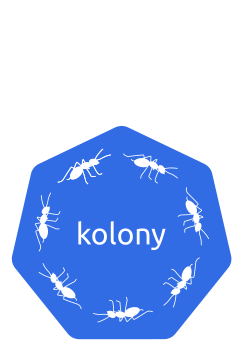

# kolony



Deploying a Kubernetes cluster on the same LAN with auto-discovery.

## Goal

Sometime you don't have direct access to your cluster so you want it to be "automatically" managed.

_kolony_ create a local cluster based on gossip and try to maintain state.

## Usage

### Requirements

- LAN network with broadcast between all nodes
- Internet connection
- `kubeadm` 
- A production environment, check: https://kubernetes.io/docs/setup/production-environment/tools/kubeadm/install-kubeadm/

### Deploy `kolony`

```
curl -o kolony https://github.com/guilhem/kolony/releases/download/0.0.1/kolony
chmod +x kolony
```

### Configuration

`kolony` read a _kolony.yaml_ file for its configuration.

```yaml
apiVersion: kolony.barpilot.io/v1alpha1
kind: ClusterConfiguration
cluster:
    name: mycluster
    master:
        number: 3
kubeadm:
    initConfiguration: |
        apiVersion: kubeadm.k8s.io/v1beta1
        kind: ClusterConfiguration
        networking:
            serviceSubnet: "10.96.0.0/12"
            podSubnet: "10.100.0.1/24"
            dnsDomain: "cluster.local"
        kubernetesVersion: "v1.12.0"
        imageRepository: "k8s.gcr.io"
        useHyperKubeImage: false
        ---
        apiVersion: kubelet.config.k8s.io/v1beta1
        kind: KubeletConfiguration
        FileCheckFrequency: 1m
```
